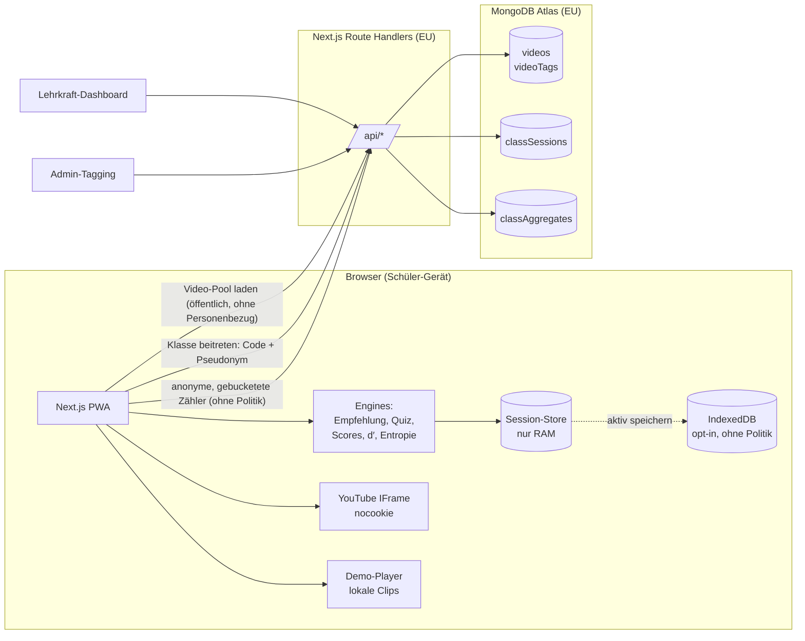
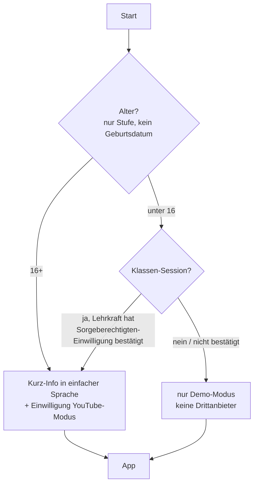

# „Guide me on the right way.“ – Architekturplan & Datenmodell

> Status: **Entwurf zur Freigabe** (Schritt 1 von 4). Es wird erst gebaut, wenn dieser Plan freigegeben ist.
> Offene Entscheidungen stehen in [Abschnitt 11](#11-offene-fragen-zur-freigabe).

---

## 1. Leitprinzipien (aus den „Nicht verhandelbar“-Regeln abgeleitet)

| Prinzip | Technische Umsetzung |
|---|---|
| **Privacy by Design** | Alles Personenbezogene (Tracking, Quiz, Blasen-Profil) wird im Browser berechnet und liegt nur im Arbeitsspeicher. Der Server kennt nur Klassen-Sessions und **bereits vergröberte, nicht verknüpfbare Zähler**. |
| **Art. 9 DSGVO (Politik)** | Politik-Daten verlassen den Arbeitsspeicher nie – auch nicht beim aktiven „Speichern“. Der Server-Endpunkt weist Politik-Kategorien zusätzlich ab (Defense in Depth, per Test abgesichert). |
| **Jede Zahl mit Quelle** | Zahlen stehen nicht im UI-Text, sondern in einer typisierten Registry `content/facts.ts` (`value`, `unit`, `sourceId`, `status`). Ein UI-Baustein `<Fact id="…"/>` rendert Zahl + ⓘ. Ein Test lässt den Build scheitern, wenn eine Zahl ohne `sourceId` auftaucht oder `status: "TODO"` in Produktion angezeigt würde. |
| **Keine Beschämung, keine Diagnose** | Die Texte liegen zentral in i18n-Dateien. Ein Lint-Test prüft auf verbotene Formulierungen (z. B. „beschädigt“, „süchtig“, „Du bist links/rechts“). |
| **Ehrliche Statistik** | Konfidenzangaben, „nicht eindeutig“ bei zu wenigen Daten, Hinweise auf korrelative Befunde und auf Interferenz- bzw. Listenlängen-Effekte. |

---

## 2. Tech-Stack

| Bereich | Wahl | Begründung |
|---|---|---|
| Framework | **Next.js 15 (App Router) + TypeScript (strict)** | wie vorgegeben; Route Handlers als minimales Backend |
| PWA | `@serwist/next` (Service Worker, Manifest, Offline-Shell) | läuft auf iPad, Android und Laptop ohne App-Store; Module 1–2 und der Demo-Modus funktionieren offline |
| Styling | Tailwind CSS + CSS-Variablen für Themes | Dark/Light über `prefers-color-scheme` + manueller Umschalter, Kontraste nach AA geprüft |
| State (lokal) | Zustand (nur im Arbeitsspeicher) | Session-Daten verschwinden beim Schließen des Tabs |
| Lokales Speichern (opt-in) | IndexedDB über `idb-keyval` | nur nach aktivem „Speichern“, **ohne Politik-Daten** |
| i18n | `next-intl`, Deutsch als Default, Struktur für `en`, `tr`, `ar`, `uk` vorbereitet | i18n-fähig, RTL-tauglich |
| Diagramme | eigene, schlanke SVG-Komponenten (Balken, Radar, Linie) mit **Datentabelle als Alternative** | volle Kontrolle über Barrierefreiheit (`role="img"`, `aria-describedby`, Tabellen-Fallback) |
| Video | YouTube IFrame Player API über `youtube-nocookie.com` **plus** lokaler Demo-Player | siehe Abschnitt 6.1 |
| Datenbank | MongoDB Atlas, Region **EU (Frankfurt, `eu-central-1`)**, offizieller `mongodb`-Treiber, Validierung mit `zod` | wie vorgegeben |
| PDF-Export | `@react-pdf/renderer`, clientseitig erzeugt | keine Daten gehen an einen PDF-Dienst |
| Tests | Vitest (Unit), Testing Library (Komponenten), Playwright (E2E) + `@axe-core/playwright` (a11y), `mongodb-memory-server` (API) | |
| Qualität | ESLint, Prettier, `tsc --noEmit`, GitHub Actions CI | |

---

## 3. Systemübersicht



**Datenflüsse, die es bewusst NICHT gibt:** Einzel-Events (Sehdauer, Likes, Skips), Quiz-Antworten, Blasen-Profile und Politik-Scores werden nie an den Server geschickt. Es gibt kein Analytics- oder Tracking-SDK von Dritten.

---

## 4. Projektstruktur

```
/app
  /(student)/            Start, Einwilligung, Module 1–3, Auswertung
  /teacher/              Dashboard (Klassen-Session, Gruppen, Export)
  /admin/                Tagging-Tool, Kappa-Übersicht
  /api/
    videos/              GET Pool (nur freigegebene Videos)
    admin/videos/        CRUD + Tags (Auth)
    class/               POST anlegen · POST join · POST contribute · GET aggregates · POST close
/src
  /engine/               reine, framework-freie TS-Module (100 % unit-getestet)
    recommender.ts       Empfehlungsalgorithmus
    tracking.ts          Event-Reduktion → VideoWatchRecord
    quizBuilder.ts       Fragenauswahl (Drittel, ≥ 3 s, Ablenker)
    sdt.ts               Hit-Rate, FA-Rate, d′ (Log-Linear-Korrektur)
    engagement.ts        Engagement-Score je Kategorie
    entropy.ts           Shannon-Entropie (gleitendes Fenster)
    politicsBubble.ts    Politik-Feed-Profil mit Konfidenz
    kappa.ts             Cohens Kappa
    timeCalculator.ts    Modul 2: Stunden/Jahr, Äquivalente
    aggregate.ts         Vergröberung (Buckets) vor dem Senden
  /content/
    facts.ts             Zahlen-Registry (jede Zahl → sourceId)
    sources.ts           Quellenverzeichnis
    cards.ts             Modul-1-Karten
    equivalents.ts       Modul-2-Äquivalente (mit Quelle oder TODO)
  /components/           Fact, SourceInfo, Charts, Feed, Quiz …
  /i18n/de.json …
/seed/videos.seed.json   60 Beispielvideos (Demo-Clips)
/docs/                   ARCHITEKTUR.md, DATENSCHUTZ-ENTWURF.md, EINWILLIGUNG-VORLAGE.md
/tests/                  e2e + a11y
```

---

## 5. Datenmodell

### 5.1 Server (MongoDB) – nur Inhalte, Sessions und anonyme Zähler

```ts
// ── Inhalte (kein Personenbezug) ────────────────────────────────
type Category =
  | "sport" | "gaming" | "comedy" | "beauty_lifestyle" | "luxury_hustle"
  | "fitness" | "news" | "politics" | "manosphere" | "knowledge"
  | "music" | "animals" | "food" | "other";          // Liste konfigurierbar

type Spectrum = "left" | "center_left" | "center" | "center_right" | "right" | "unassignable";

interface Video {
  _id: string;
  source: { kind: "youtube"; youtubeId: string } | { kind: "demo"; demoClipId: string };
  title: string;
  durationSec: number;
  stillImageUrl: string;            // Standbild fürs Quiz (eigenes Asset oder YT-Thumbnail laut ToS)
  facts: QuizFact[];                // 1–2 prüfbare Fakten
  hasDog?: boolean;                 // für die prospektive Aufgabe „Tippe auf 🐶“
  ageRating: "12+" | "16+";
  status: "draft" | "tagging" | "released" | "rejected";
  // abgeleitet aus zwei unabhängigen Taggings:
  consensus?: {
    category: Category | null;      // null = strittig
    spectrum?: Spectrum | null;     // nur bei Politik; null = strittig → nicht in die Politik-Auswertung
    agreed: boolean;
  };
  createdAt: Date; updatedAt: Date;
}

interface QuizFact {
  id: string;
  kind: "number" | "place" | "product" | "statement";
  question: string;                 // „Wie viele Liegestütze zeigt der Clip?“
  correct: string;
  distractors: [string, string, string];
}

interface VideoTag {                // ein Dokument pro Rater und Video; Rater sehen sich gegenseitig nicht
  _id: string;
  videoId: string;
  raterId: string;                  // Admin-Account, kein Schüler
  category: Category;
  spectrum?: Spectrum;
  taggedAt: Date;
}
// Index: unique(videoId, raterId). Konsens erst ab 2 Tags; Kappa wird über den Pool berechnet.

// ── Klassen-Sessions ────────────────────────────────────────────
interface ClassSession {
  _id: string;
  joinCode: string;                 // 6 Zeichen, ohne verwechselbare Zeichen (0/O, 1/I)
  teacherKeyHash: string;           // argon2 – der Lehrer-Schlüssel liegt nur im Lehrer-Browser
  groups: { id: "A" | "B" | "C"; label: string; durationMin: 15 | 30 | 60 }[];
  guardianConsentConfirmed: boolean;// Lehrkraft bestätigt: Einwilligungen (u16) liegen der Schule vor
  videoMode: "demo" | "youtube";
  state: "open" | "running" | "closed";
  createdAt: Date;
  expiresAt: Date;                  // TTL-Index → automatische Löschung (Default: 7 Tage)
}

interface ClassParticipant {        // nur zur Anzeige „wer ist drin“, NIE mit Ergebnissen verknüpft
  _id: string;
  sessionId: string;
  pseudonym: string;                // generiert, z. B. „Blauer Otter 42“, Freitext nur mit Filter
  groupId: "A" | "B" | "C";         // vom Server zufällig oder von der Lehrkraft zugewiesen
  joinedAt: Date;
  expiresAt: Date;                  // TTL
}

interface ContributionToken {       // einmalig nutzbar, verhindert Doppel-Einreichung
  _id: string;                      // SHA-256 des Tokens
  sessionId: string;
  groupId: string;
  expiresAt: Date;
}
// Das Token wird beim Join ausgegeben, aber OHNE Referenz auf den Participant gespeichert.

interface ClassAggregate {          // ein Dokument pro Session × Gruppe; nur Zähler ($inc)
  _id: string;                      // `${sessionId}:${groupId}`
  sessionId: string;
  groupId: string;
  n: number;
  factsRecalledPctHist: number[];   // 10 Buckets à 10 %-Punkte
  recognitionHitHist: number[];     // 10 Buckets
  videosSeenHist: number[];         // Buckets: 0–19, 20–39, … , 200+
  prospectiveSuccess: number;       // Anzahl erfolgreicher prospektiver Aufgaben
  topCategoryCounts: Partial<Record<Exclude<Category, "politics" | "news">, number>>;
  expiresAt: Date;
}
```

**Warum Zähler statt Einzeldatensätze?** Aus einem Aggregat lässt sich eine einzelne Einreichung nicht zurückrechnen, weil es keine Einzeldokumente gibt. Gegen den Differenzangriff (die Lehrkraft beobachtet, wie sich der Zähler von n=5 auf n=6 ändert) hilft eine zweite Regel: **Ergebnisse werden erst angezeigt, wenn die Lehrkraft die Runde schließt und die Gruppe mindestens 5 Teilnehmende hat.** Live sieht die Lehrkraft nur den Fortschritt: „12 von 24 fertig“.

*Hinweis zu `news`:* Nachrichten sind nicht per se politisch. Weil einzelne Nachrichtenclips aber Rückschlüsse auf politisches Interesse zulassen können, schlage ich vor, auch sie aus dem Dashboard herauszuhalten. → Frage 6.

### 5.2 Client – nur im Arbeitsspeicher (Zustand-Store)

```ts
interface ArenaSession {
  id: string;                       // zufällige UUID, nur lokal
  durationMin: 15 | 30 | 60;
  startedAt: number;
  baseline: BaselineResult;
  prospective: ProspectiveTask;
  feed: VideoWatchRecord[];         // in Abspielreihenfolge
  recommenderState: RecommenderState;
  quiz?: QuizResult;
}

interface VideoWatchRecord {
  videoId: string;
  position: number;                 // Index im Feed
  shownAtSec: number;               // Sekunden seit Session-Start
  watchedSec: number;
  completed: boolean;               // ≥ 95 % der Laufzeit
  replays: number;                  // Loop-Neustarts
  skipped: boolean;                 // < 2 s gesehen
  liked: boolean;
  third: 1 | 2 | 3;                 // Session-Drittel (für Quiz und Auswertung)
}

interface BaselineResult { items: string[]; hits: number; falseAlarms: number; dPrime: number; }

interface ProspectiveTask {
  kind: "word_at_end" | "tap_on_dog";
  target: string;
  dogOccurrences?: { videoId: string; tapped: boolean }[];
  answeredCorrectly?: boolean;
}

interface QuizResult {
  items: QuizItemResult[];
  hitRate: number; falseAlarmRate: number; dPrime: number;
  factsRecalledPct: number;
  byThird: Record<1 | 2 | 3, number>;
  orderCorrect: boolean;
  prospectiveSuccess: boolean;
  deltaToBaseline: number;
}

interface BubbleProfile {           // NIE persistiert, NIE übertragen
  servedShare: Record<Category, number>;       // „Womit dich der Feed gefüttert hat“
  engagement: Record<Category, number>;        // „Wo du am längsten hängen geblieben bist“
  entropyCurve: { tSec: number; entropy: number }[];
  politics: PoliticsFeedProfile;
}

type PoliticsFeedProfile =
  | { status: "insufficient_data" }
  | { status: "no_narrowing" }
  | { status: "narrowed"; spectrum: Spectrum; ratioToPool: number; confidence: "medium" | "high" };
```

### 5.3 Client – opt-in gespeichert (IndexedDB)

```ts
interface SavedRound {              // nur nach aktivem Tippen auf „Speichern“, jederzeit löschbar
  savedAt: string;
  durationMin: 15 | 30 | 60;
  videosSeen: number;
  minutesInvested: number;
  factsRecalledPct: number;
  dPrime: number;
  baselineDPrime: number;
  // bewusst ohne: Kategorien-Profil, Politik, Einzel-Events
}
```

---

## 6. Kernalgorithmen

### 6.1 Video-Wiedergabe
- **YouTube-Modus:** IFrame Player API über `www.youtube-nocookie.com`. Keine Überlagerung von Branding oder Steuerelementen; Like und Wischen laufen über eigene Bedienelemente außerhalb des Player-Bereichs. Die Sehdauer kommt aus `onStateChange` + `getCurrentTime()`. Autoplay ist auf iOS nur stumm erlaubt, deshalb startet die Session mit einem „Ton an“-Tap. Ob Shorts per IFrame-API einbettbar und automatisch abspielbar sind, muss **auf echten Schul-iPads getestet** werden (Risiko R1).
- **Demo-Modus (Default für Entwicklung und für Klassen ohne YouTube-Einwilligung):** lokale, selbst erzeugte Kurzclips (animierte Karten mit Text, Formen und Zählern). Sie sind klar als Demo gekennzeichnet und übertragen keine Daten an Dritte. Die 60 Seed-Videos gehören zu diesem Modus – **ich erfinde keine YouTube-IDs**.

### 6.2 Empfehlungsalgorithmus (transparent, konfigurierbar)
```
Interesse_k ← Σ über gesehene Videos v der Kategorie k:
              w_watch · (watchedSec / durationSec) + w_replay · replays + w_like · liked − w_skip · skipped
p_k ∝ max(ε_floor, Interesse_k)^β / Poolanteil_k^γ   (γ mildert Überrepräsentation im Pool)
Nächstes Video: mit Wahrscheinlichkeit ε (≥ 0,10) zufällig aus dem gesamten Pool,
                sonst Kategorie ~ p, darin ein zufälliges ungesehenes Video.
```
Konfiguration in `config/recommender.ts`: `epsilon` (Minimum 0,10, erzwungen), `weights`, `beta` (Verstärkung), `poolSize`, `coldStartVideos` (die ersten N Videos sind stratifiziert zufällig). Ein Transparenz-Panel („So hat der Feed entschieden“) zeigt nach der Session die Gewichtsverläufe.

### 6.3 Quiz
- **Kandidaten:** Videos mit `watchedSec ≥ 3`, aufgeteilt nach Session-Drittel. Die Fragen werden **gleichmäßig über die Drittel gezogen** (stratifiziert, per Seed reproduzierbar).
- **Feste Fragenanzahl** (Vorschlag, gleich für alle Dauern, damit die Werte vergleichbar sind – siehe Frage 4):
  - (a) Wiedererkennen: 12 Standbilder = 6 gesehene (2 pro Drittel) + 6 Ablenker aus nicht gezeigten Pool-Videos derselben Kategorien
  - (b) Fakten-MC: 6 Fragen (2 pro Drittel)
  - (c) Reihenfolge: 1 Aufgabe mit 3 Videos (je eins aus jedem Drittel)
  - (d) Prospektive Aufgabe: 1
- **d′** = z(H) − z(FA) mit Log-Linear-Korrektur nach Hautus (1995): H = (Hits + 0,5)/(Signale + 1), FA analog. Das verhindert unendliche Werte bei 0 % bzw. 100 %.
- **Baseline:** 8 Begriffe merken → 16 Items wiedererkennen (8 alt, 8 neu) → d′_baseline.
- **Wording:** Die Auswertung heißt „So viel ist hängen geblieben“. Ein Info-Kasten erklärt Interferenz und Listenlänge.

### 6.4 Engagement, Entropie, Politik-Profil
- **Engagement_k** = [Σ (w₁·Sehanteil + w₂·Likes + w₃·Wiederholungen − w₄·Skips)] / Anzahl gezeigter Videos in k, geteilt durch den Poolanteil von k. So wird eine Kategorie nicht „stark“, nur weil sie im Pool häufig ist.
- **Entropie:** Shannon-Entropie H = −Σ pᵢ log₂ pᵢ über die Kategorien in einem gleitenden Fenster (Default: 10 Videos), normiert auf log₂(K) → 0…1. Die Kurve zeigt die Verengung.
- **Politik-Feed-Profil:** Es gehen nur Videos mit Konsens-Spektrum ein (beide Rater einig). Bedingungen: Politik-Anteil ≥ `minShare` (Default 15 %) **und** ≥ `minCount` (Default 6) Politikvideos **und** ein Spektrum mit einem Engagement von ≥ `ratio` (Default 1,5) × Pool-Durchschnitt. Die Konfidenz ergibt sich aus einem Bootstrap über die Politikvideos (1000 Resamples): Wird das Spektrum in ≥ 90 % der Resamples bestätigt, gilt „hoch“, bei ≥ 70 % „mittel“, sonst „nicht eindeutig“. Die Ausgabe beschreibt immer den Feed, nie die Person: *„Dein Feed hat sich in Richtung … verengt – dort hast du am längsten zugeschaut.“*
- **Cohens Kappa:** κ = (p_o − p_e)/(1 − p_e), getrennt für Kategorie und Spektrum, angezeigt im Admin-Tool mit Einordnung nach Landis & Koch (1977).

### 6.5 Modul 2 – Zeitrechner
Stunden/Jahr = min/Tag × 365 / 60. Die Äquivalente kommen aus `equivalents.ts`, jedes mit `sourceId` oder `status: "TODO"`. Ohne Quelle wird ein Äquivalent **nicht angezeigt**, statt geschätzt.

---

## 7. Datenschutz & Einwilligung



- **Rechtsgrundlagen (Entwurf, juristisch zu prüfen):** Klassenfunktion → Art. 6 (1) e DSGVO i. V. m. dem jeweiligen Landesschulgesetz oder Einwilligung. YouTube-Einbettung → Einwilligung nach § 25 TDDDG + Art. 6 (1) a, unter 16 durch die Sorgeberechtigten (Art. 8). Die lokale Verarbeitung im Browser findet nicht beim Betreiber statt; darüber wird trotzdem transparent informiert.
- **Löschung:** Der RAM-Store wird beim Schließen des Tabs und über den Button „Alles löschen“ geleert. Serverseitig löschen TTL-Indizes automatisch (Default 7 Tage). Die Lehrkraft kann eine Session auch sofort löschen.
- **Kein Klarname:** Das Pseudonym wird generiert. Freitext ist nur mit Filter gegen Klarnamen- und Beleidigungsmuster möglich (Vorschlag: nur generierte Pseudonyme).
- **Server-Logs:** keine IP-Speicherung in der Anwendung; beim Hoster ist sie zu deaktivieren bzw. zu kürzen.
- Lieferung: `docs/DATENSCHUTZ-ENTWURF.md`, `docs/EINWILLIGUNG-VORLAGE.md` (Elternbrief), `docs/VVT-ENTWURF.md` (Verzeichnis von Verarbeitungstätigkeiten) und eine Skizze für eine DSFA.

---

## 8. Barrierefreiheit (WCAG 2.2 AA)
- Wischen hat immer eine Alternative: Buttons „Weiter/Zurück“, Pfeiltasten, Bildlauf (2.5.1 Pointer Gestures, 2.5.7 Dragging Movements). Touch-Ziele sind ≥ 24 px (2.5.8).
- `prefers-reduced-motion` schaltet Autoplay-Übergänge und Animationen ab. Pausieren ist jederzeit möglich (2.2.2).
- Jedes Diagramm hat eine Textzusammenfassung und eine Datentabelle. Farbe ist nie der einzige Informationsträger.
- Fokus-Management bei Karten- und Quizwechsel; `aria-live` für Auswertungen.
- Automatisierte Prüfung mit axe in Playwright für jede Seite, in beiden Themes. Dazu kommt eine manuelle Checkliste (VoiceOver auf iPad, TalkBack).

---

## 9. Teststrategie
| Ebene | Inhalt |
|---|---|
| Unit (Vitest) | `sdt` (bekannte d′-Werte, Randfälle 0/100 %), `entropy` (Gleichverteilung = 1, eine Kategorie = 0), `engagement` (Pool-Normierung), `kappa` (Lehrbuchbeispiele), `recommender` (ε ≥ 0,1 wird erzwungen, empirische Zufallsquote über 10.000 Ziehungen, Verstärkungseffekt), `quizBuilder` (Drittel-Balance, ≥ 3 s, Ablenker nie gesehen, feste Anzahl), `politicsBubble` (zu wenig Daten → „nicht eindeutig“, strittige Videos ausgeschlossen), `timeCalculator`, `aggregate` (Politik und Nachrichten werden entfernt) |
| Content | Jede Zahl hat eine Quelle; keine verbotenen Formulierungen; alle i18n-Keys vorhanden |
| API | `contribute` weist Politik-Felder und doppelte Tokens ab; `aggregates` liefert nichts bei n < 5 oder offener Runde |
| E2E | kompletter 15-min-Durchlauf im Zeitraffer-Modus (Testuhr), Klassen-Flow Lehrkraft ↔ Schüler |
| a11y | axe auf allen Routen, Tastatur-only-Durchlauf |

---

## 10. Bau-Reihenfolge (nach Freigabe)
1. Grundgerüst: Next.js, PWA, Themes, i18n, Quellen-Registry, CI
2. **Admin-Tagging-Tool** + Kappa + Seed (60 Demo-Videos)
3. **Scroll-Arena** mit Demo-Player, YouTube-Player, Tracking, Empfehlungsalgorithmus, Baseline, prospektiver Aufgabe
4. **Quiz**
5. **Auswertung + Blasen-Profil** + „Blase platzen lassen“
6. **Module 1 & 2**
7. **Lehrer-Dashboard** + PDF-Export + Arbeitsblatt
8. README mit TODOs, Quellenliste und Liste der fachlich zu prüfenden Aussagen

---

## 11. Offene Fragen zur Freigabe

1. **Arbeitspapier fehlt:** `Kurzvideo_Filterblasen_OnlyFans_Analyse.docx` liegt nicht im Repository. Bitte ins Repo legen (z. B. unter `docs/quellen/`). Bis dahin nutze ich nur die fünf Zahlen aus dem Auftrag. Karten 6–8, die vollständigen bibliografischen Angaben und alle Äquivalenzwerte bleiben **TODO**.
2. **Hosting:** Vercel (Region `fra1`, US-Anbieter mit AVV/DPF) oder ein EU-Hoster mit Docker (z. B. Hetzner, IONOS)? Für Schulen empfehle ich einen **EU-Hoster**.
3. **Videos:** Ist es in Ordnung, dass die 60 Seed-Videos **selbst erzeugte Demo-Clips** sind und die echten YouTube-Shorts später über das Admin-Tool kuratiert werden? Echte IDs kann und will ich nicht erfinden.
4. **Quiz-Umfang:** gleiche Fragenanzahl für 15, 30 und 60 min (Vorschlag: 12 + 6 + 1 + 1) oder eine eigene feste Anzahl pro Dauer?
5. **Admin-Zugang:** einfache Konten für die Rater (E-Mail + Passwort, per Umgebungsvariable angelegt) oder Magic-Link?
6. **Nachrichten im Dashboard:** Soll die Kategorie „Nachrichten“ wie Politik aus dem Lehrer-Dashboard herausgehalten werden (Vorschlag: ja)?
7. **Pool-Größe:** Bei 60 min und Skips entstehen leicht 150–300 Videoaufrufe. Für einen sauberen Wiedererkennungstest ohne Wiederholungen braucht der Pool **≥ 300 freigegebene Videos**. 60 Seed-Videos reichen für 15 min; bei längeren Sessions würde der Demo-Modus Videos wiederholen und diese dann aus dem Quiz ausschließen. Einverstanden?

## 12. Risiken
| # | Risiko | Gegenmaßnahme |
|---|---|---|
| R1 | YouTube blockiert Einbettung oder Autoplay von Shorts bzw. im Schulnetz | Demo-Modus als vollwertige Alternative; Vorab-Test auf Schulgeräten |
| R2 | YouTube-Einbettung = Datenübermittlung an Google (USA) | nocookie-Domain, Einwilligung, unter 16 nur mit bestätigter Sorgeberechtigten-Einwilligung, sonst Demo |
| R3 | Die Ergebnisse werden als Diagnose missverstanden | Wording-Tests, Info-Kästen, keine Normwerte, nur Vergleich mit sich selbst |
| R4 | Politische Unausgewogenheit des Pools | Pool-Balance-Check im Admin-Tool (Anteil je Spektrum), Freigabe erst bei Ausgewogenheit, Beutelsbacher Konsens im Redaktionsleitfaden |
| R5 | Rückschluss auf Einzelne im Dashboard | Zähler statt Einzeldatensätzen, n ≥ 5, Anzeige erst nach Rundenende |
