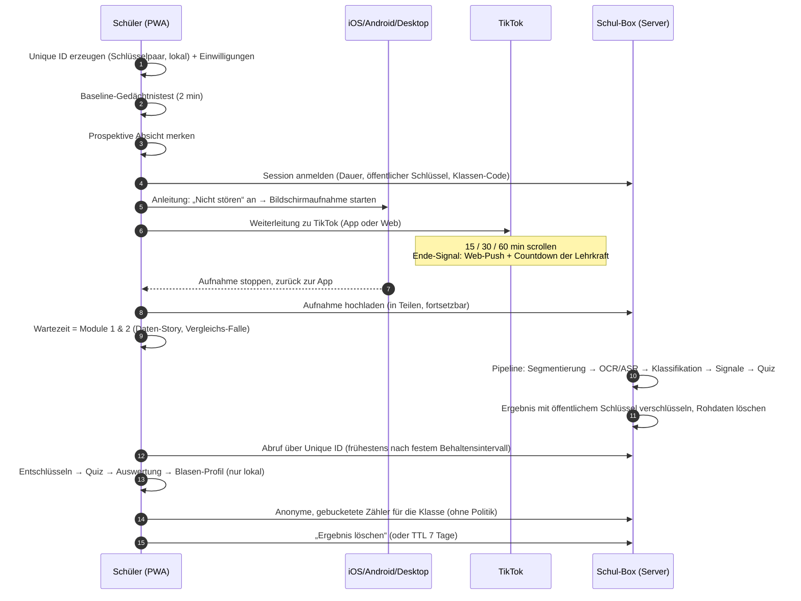
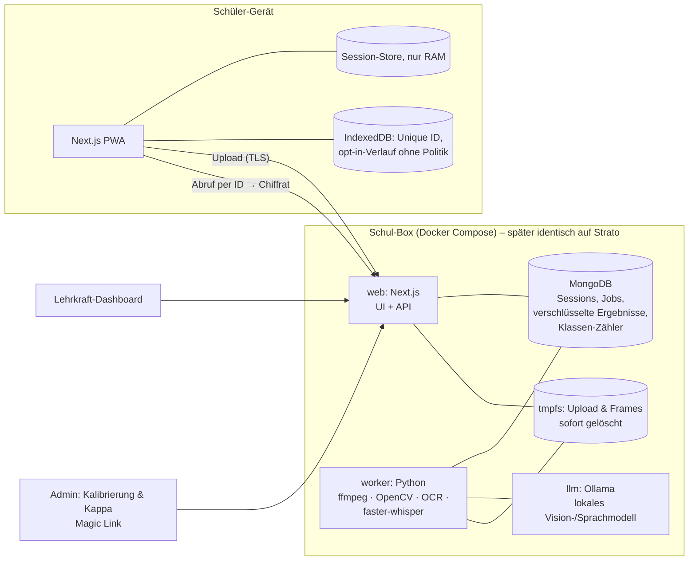

# „Guide me on the right way.“ – Architekturplan & Datenmodell · v2

> Status: **Entwurf v2 zur Freigabe.** v2 ersetzt den YouTube-Pool durch **echtes TikTok + Bildschirmaufnahme + serverseitige Auswertung**.
> Die Entscheidungen aus Runde 1 sind eingearbeitet: Strato-ready, zunächst lokal · Magic Link · Nachrichten bleiben im Dashboard · Quiz-Struktur bleibt, der **Schwerpunkt liegt auf inhaltlichen Fragen**.
> Punkte, die vor dem Bauen entschieden werden müssen, stehen in [Abschnitt 12](#12-entscheidungen-vor-dem-bau).

---

## 0. Was sich gegenüber v1 ändert

| v1 | v2 |
|---|---|
| Kuratierter Video-Pool, eingebettet per YouTube-API | Schüler scrollt **im echten TikTok**, die App leitet dorthin weiter |
| Tracking im Browser | Die **Bildschirmaufnahme** wird nach der Session hochgeladen und von einer **Verarbeitungs-Pipeline** ausgewertet |
| Eigener, transparenter Empfehlungsalgorithmus | entfällt – den Feed macht TikToks Algorithmus. Das ist didaktisch stärker, weil es die echte Blase ist |
| Admin-Tagging des Pools, Kappa zwischen Ratern | Admin-Tool dient der **Validierung des Klassifikators**: Kappa Mensch–Mensch und Mensch–Modell auf Kalibrieraufnahmen |
| Alles Personenbezogene nur im Browser | Die Aufnahme **muss** zur Auswertung einen Rechner erreichen, siehe Abschnitt 1 |
| Ergebnis sofort | Ergebnis nach der Verarbeitung, abrufbar über die **Unique ID** |

---

## 1. ⚠️ Konflikt mit den „Nicht verhandelbar“-Regeln – mein Lösungsvorschlag

Der neue Ablauf verträgt sich nicht mit zwei Regeln aus dem Auftrag und einem Leitprinzip des eigenen Arbeitspapiers:

- *„Keine Übertragung individueller Verhaltens- oder Politikdaten.“* Eine Bildschirmaufnahme **ist** ein individueller Verhaltensdatensatz. Die Politik-Klassifikation (Art. 9 DSGVO) findet dann auf einem Rechner statt, nicht im Browser.
- *„Personenbezogene Auswertungen nur lokal im Browser.“* Eine 15–60-minütige Aufnahme lässt sich auf einem Schul-iPad nicht per OCR, Spracherkennung und Klassifikation im Browser verarbeiten.
- Arbeitspapier, Kap. 12.1: *„Verarbeitung möglichst auf dem Gerät; keine Übertragung von Inhalten an Server.“*

**Vorschlag: „So nah am Gerät wie möglich, so kurz wie möglich, danach unlesbar für alle außer dem Schüler.“**

1. **Die Verarbeitung läuft im Schulnetz, nicht in der Cloud.** Standardbetrieb ist die „Schul-Box“: der Rechner der Lehrkraft oder ein Schulserver mit Docker. Die Aufnahme verlässt das Schul-WLAN nicht. Strato ist nur ein optionaler zweiter Betriebsmodus mit gleichem Code und AVV mit Strato.
2. **Die Rohaufnahme wird sofort nach der Analyse gelöscht.** Scheitert die Analyse, wird sie spätestens nach 24 h gelöscht. Es gibt keine Backups des Upload-Verzeichnisses. Zwischenprodukte (Frames, Transkript) liegen nur in einem RAM-Dateisystem (tmpfs).
3. **Ende-zu-Ende-verschlüsseltes Ergebnis.** Die Unique ID ist ein Schlüssel, den das Gerät erzeugt. Der Server bekommt nur den öffentlichen Teil und speichert das Ergebnis ausschließlich verschlüsselt. Weder Lehrkraft noch Admin noch Betreiber können es lesen (Details in Abschnitt 5.2).
4. **Die Politik-Analyse ist eine gesonderte, ausdrückliche Einwilligung** nach Art. 9 (2) a DSGVO, unter 16 zusätzlich durch die Sorgeberechtigten. Ohne diese Einwilligung klassifiziert die Pipeline Politikvideos nur als „Politik“, ohne Spektrum.
5. **Keine Drittanbieter-KI.** OCR, Spracherkennung und Sprachmodell laufen lokal. Es geht nichts an OpenAI, Anthropic, Google o. Ä.
6. **Lehrer-Dashboard unverändert anonym:** Zähler statt Einzeldatensätze, n ≥ 5, Anzeige erst nach Rundenende, keine Politik.

Die Regel müsste dann lauten: *„Keine **dauerhafte** Speicherung und keine Weitergabe individueller Verhaltens- oder Politikdaten; kurzzeitige Verarbeitung nur in der Schul-Box.“* **→ Das ist Entscheidung E1.**

---

## 2. Ablauf aus Schülersicht



### 2.1 Aufnahme je Plattform (muss vorab auf Schulgeräten getestet werden)
| Gerät | Aufnahme | Upload |
|---|---|---|
| **iPad / iPhone** | Systemeigene Bildschirmaufnahme (Kontrollzentrum). Eine Web-App kann die Aufnahme **nicht selbst starten**, die App führt Schritt für Schritt durch. | Datei aus „Fotos“ auswählen |
| **Android** | Systemeigener Bildschirmrekorder (ab Android 11, Schnelleinstellungen), herstellerabhängig | Datei aus „Galerie“ auswählen |
| **Laptop (Chrome/Edge/Firefox)** | `getDisplayMedia` direkt aus der PWA: Der Schüler teilt den TikTok-Tab, die App nimmt mit `MediaRecorder` auf | automatisch, fortlaufend in Teilen |

**Upload-Volumen:** Eine 60-Minuten-Aufnahme auf dem iPad hat grob 2–5 GB. Bei 25 Schülern im WLAN ist das kritisch. Vorgesehen ist deshalb eine **Vorverarbeitung im Browser, wo möglich** (WebCodecs: 2 Bilder/s in 540p + Audio als Opus). Das reduziert die Datenmenge auf ~5 %. Als Fallback wird die Originaldatei per `tus` (fortsetzbarer Upload) übertragen. Welche Variante auf Schul-iPads trägt, klärt Spike S1.

### 2.2 Ende-Signal
Die PWA läuft im Hintergrund, während TikTok im Vordergrund ist. Das Ende kommt deshalb (a) im Klassenmodus über einen **großen Countdown der Lehrkraft** am Beamer und (b) über eine **Web-Push-Benachrichtigung** vom Server. Das funktioniert auf iOS nur, wenn die PWA zum Home-Bildschirm hinzugefügt wurde (ab iOS 16.4). Die Pipeline schneidet die Aufnahme ohnehin auf die gewählte Dauer zu, damit Sessions vergleichbar bleiben.

---

## 3. Systemübersicht



---

## 4. Tech-Stack

| Bereich | Wahl |
|---|---|
| Frontend | **Next.js 15 (App Router) + TypeScript strict**, PWA via `@serwist/next`, Tailwind, `next-intl` (de zuerst), eigene barrierefreie SVG-Diagramme mit Tabellen-Fallback |
| Kryptografie im Client | WebCrypto: X25519/ECDH (Fallback P-256) + HKDF + AES-GCM, gekapselt in `src/crypto/` |
| Upload | `tus-js-client` ↔ `@tus/server` im Next.js-Backend; Chunk-Ziel ist tmpfs |
| Auth Lehrkraft/Admin | **Magic Link** über Auth.js (E-Mail-Provider). Lokal läuft Mailpit (Mails im Browser ansehen), auf Strato der Strato-SMTP. Rollen: `teacher`, `rater`, `admin` |
| Datenbank | MongoDB 7: lokal als Docker-Container, auf Strato selbst gehostet oder Atlas EU (Frankfurt). Zugriff über den offiziellen Treiber + `zod` |
| Job-Queue | MongoDB-basiert (Collection `jobs`, atomisches `findOneAndUpdate`), kein Redis nötig |
| Worker | **Python 3.12**: `ffmpeg`, OpenCV (Szenen-/Scroll-Erkennung, Template-Matching), PaddleOCR (Fallback Tesseract), `faster-whisper` (Deutsch/Englisch), `imagehash` |
| Sprach-/Vision-Modell | **Ollama, lokal**, z. B. Qwen2.5-VL 7B (Bildbeschreibung) + Qwen2.5 7B Instruct (Klassifikation, Fragen). Das Modell ist konfigurierbar und wird nach Spike S2 festgelegt |
| PDF | `@react-pdf/renderer`, clientseitig |
| Tests | Vitest, Testing Library, Playwright + axe, `pytest` für den Worker, `mongodb-memory-server` |
| Betrieb | `docker compose up` = Schul-Box. Ein zweites Profil `compose.strato.yml` mit Caddy (TLS) für einen Strato-VPS |

---

## 5. Datenmodell

### 5.1 Server (MongoDB)

```ts
// ── Arena-Session (eine pro Schüler-Durchgang) ─────────────────────
interface ArenaSession {
  _id: string;                        // = retrievalId (siehe 5.2), kein Name
  publicKey: string;                  // X25519, base64 – zum Verschlüsseln des Ergebnisses
  durationMin: 15 | 30 | 60;
  classSessionId?: string;            // falls im Klassenmodus
  groupId?: "A" | "B" | "C";
  consents: {
    analysis: true;                   // ohne diese keine Session
    politicsSpectrum: boolean;        // Art. 9 – gesondert
    guardianConfirmed?: boolean;      // unter 16: von der Lehrkraft bestätigt
  };
  ageBand: "u13" | "13-15" | "16+";   // nur Stufe; u13 → kein TikTok-Modus (siehe E3)
  prospective: { kind: "word_at_end" | "like_first_dog"; };  // Zielwort bleibt nur im Client
  status: "registered" | "uploading" | "queued" | "processing" | "ready" | "failed" | "deleted";
  quizUnlockAt?: Date;                // Ende der Aufnahme + festes Behaltensintervall
  result?: EncryptedBlob;             // nur verschlüsselt
  createdAt: Date;
  expiresAt: Date;                    // TTL-Index: 7 Tage
}

interface EncryptedBlob {
  ephemeralPublicKey: string;         // ECIES: ephemeres Server-Schlüsselpaar
  iv: string;
  ciphertext: string;                 // AES-256-GCM über JSON(AnalysisResult)
  schemaVersion: number;
}

interface Job {                        // Verarbeitungsauftrag, enthält keine Inhalte
  _id: string;
  arenaSessionId: string;
  uploadPath: string;                 // auf tmpfs
  state: "queued" | "running" | "done" | "failed";
  stage?: "segment" | "ocr_asr" | "classify" | "signals" | "quiz" | "encrypt";
  progress: number;                   // 0–1, für die Fortschrittsanzeige
  attempts: number;
  lockedUntil?: Date;
  expiresAt: Date;
}

// ── Klassen-Session (wie v1, leicht angepasst) ─────────────────────
interface ClassSession {
  _id: string;
  joinCode: string;                   // 6 Zeichen
  teacherUserId: string;              // Magic-Link-Konto der Lehrkraft
  groups: { id: "A" | "B" | "C"; label: string; durationMin: 15 | 30 | 60 }[];
  guardianConsentConfirmed: boolean;
  retentionIntervalMin: number;       // festes Intervall bis zum Quiz (Default 30)
  state: "open" | "running" | "closed";
  startedAt?: Date;                   // für den gemeinsamen Countdown
  expiresAt: Date;
}

interface ClassParticipant { _id: string; sessionId: string; pseudonym: string; groupId: string; expiresAt: Date; }
// wird NIE mit ArenaSession verknüpft (keine gemeinsame ID gespeichert)

interface ContributionToken { _id: string /* sha256 */; sessionId: string; groupId: string; expiresAt: Date; }

interface ClassAggregate {             // nur $inc-Zähler, pro Session × Gruppe
  _id: string; sessionId: string; groupId: string; n: number;
  contentCorrectPctHist: number[];    // 10 Buckets – Kernkennwert
  recognitionDPrimeHist: number[];    // Buckets −1…4 in 0,5er-Schritten
  videosSeenHist: number[];           // 0–19, 20–39, …, 200+
  prospectiveSuccess: number;
  topCategoryCounts: Partial<Record<Exclude<Category, "politics">, number>>;  // inkl. „news“
  entropyDropHist: number[];          // Verengung (Start- vs. End-Entropie), Buckets
  expiresAt: Date;
}

// ── Klassifikator-Validierung (ersetzt das Pool-Tagging) ───────────
interface CalibrationRecording {       // NUR Aufnahmen des Projektteams mit Test-Accounts, nie Schülerdaten
  _id: string; title: string; device: string; tiktokVersion?: string;
  segments: CalibrationSegment[];
  createdBy: string; createdAt: Date;
}
interface CalibrationSegment {
  id: string; startSec: number; endSec: number; keyframeUrl: string;
  model: { category: Category; spectrum?: Spectrum; confidence: number; liked: boolean; replayed: boolean };
}
interface RaterTag {                   // unique(recordingId, segmentId, raterId); Rater sehen einander nicht
  _id: string; recordingId: string; segmentId: string; raterId: string;
  category: Category; spectrum?: Spectrum;
  boundaryOk: boolean; likeOk: boolean; replayOk: boolean;   // prüft auch die Signal-Erkennung
}
interface ValidationReport {           // berechnet, versioniert je Modell-/Prompt-Version
  _id: string; modelVersion: string; createdAt: Date;
  kappaHumanHuman: { category: number; spectrum: number };
  kappaHumanModel: { category: number; spectrum: number };
  perSpectrumRecall: Record<Spectrum, number>;   // Bias-Audit: gleich gute Erkennung links wie rechts?
  segmentationF1: number; likeDetectionF1: number; replayDetectionF1: number;
  politicsEnabled: boolean;           // Politik-Spektrum nur freigegeben, wenn Schwellen erreicht (E6)
}
```

### 5.2 Unique ID & Verschlüsselung
- Das Gerät erzeugt **32 zufällige Bytes** (`seed`). Daraus werden per HKDF abgeleitet: ein X25519-Schlüsselpaar und die `retrievalId` = Base32(SHA-256(publicKey))[0..16].
- **Angezeigte Unique ID** = `seed` in Base32, gruppiert (z. B. `GUID-E7K2-…`), plus QR-Code. Sie liegt in IndexedDB. Wer sie verliert, verliert das Ergebnis – das ist gewollt. Die App bietet an, sie zu notieren oder zu fotografieren.
- Der Server sieht nur `retrievalId` und `publicKey`. Er verschlüsselt das Ergebnis per ECIES mit dem öffentlichen Schlüssel und verwirft danach das Klartext-Ergebnis. **Entschlüsseln kann nur, wer die Unique ID hat.**
- Rate-Limit und Sperre gegen das Durchprobieren von `retrievalId`s. Die ID ist 80 Bit lang und damit nicht erratbar.

### 5.3 Ergebnis der Pipeline (Klartext existiert nur im Worker-RAM und im Schüler-Browser)

```ts
type Category =
  | "sport" | "gaming" | "comedy" | "beauty_lifestyle" | "luxury_hustle" | "fitness"
  | "news" | "politics" | "manosphere" | "knowledge" | "music_dance" | "animals"
  | "food" | "relationships" | "sexualized" | "advertising" | "other";   // konfigurierbar
type Spectrum = "left" | "center_left" | "center" | "center_right" | "right" | "unassignable";

interface AnalysisResult {
  meta: { durationMin: number; analyzedSec: number; pipelineVersion: string; modelVersion: string;
          politicsSpectrumEnabled: boolean; warnings: string[] };   // z. B. „Aufnahme ohne Ton“
  segments: Segment[];                // ein Eintrag pro TikTok-Video in Abspielreihenfolge
  quiz: QuizDefinition;
}

interface Segment {
  index: number;
  startSec: number; endSec: number;   // relativ zum Start der Aufnahme
  watchedSec: number;
  third: 1 | 2 | 3;
  kind: "video" | "photo_carousel" | "live" | "ad" | "non_tiktok";   // non_tiktok wird verworfen
  skipped: boolean;                   // < 2 s
  liked: boolean | null;              // null = nicht sicher erkennbar
  replays: number | null;             // Loop-Erkennung, null = unsicher
  completed: boolean | null;
  category: Category; categoryConfidence: number;
  spectrum?: Spectrum; spectrumConfidence?: number;   // nur mit Art.-9-Einwilligung und freigegebenem Modell
  hasDog?: boolean;                   // für die prospektive Aufgabe
  keyframeJpeg: string;               // kleines Standbild (base64, ~15 KB) – Nutzernamen/Gesichter ggf. unscharf (E5)
  summary: string;                    // 1 Satz: „Eine Person kocht Nudeln mit Feta.“
}

interface QuizDefinition {
  seed: number;
  recognition: { segmentIndex?: number; distractorId?: string; image: string; isOld: boolean; third?: 1 | 2 | 3 }[];
  content: ContentQuestion[];         // Kern des Quiz
  order: { segmentIndices: [number, number, number]; images: [string, string, string] };
  prospective: { kind: "word_at_end" | "like_first_dog"; firstDogSegment?: number; likedIt?: boolean | null };
}

interface ContentQuestion {
  id: string; segmentIndex: number; third: 1 | 2 | 3;
  type: "gist" | "detail";            // Kernaussage vs. Detail (Zahl, Ort, Produkt, Aussage)
  question: string; options: [string, string, string, string]; correctIndex: 0 | 1 | 2 | 3;
  evidence: { source: "transcript" | "onscreen_text" | "visual"; quote: string };  // Beleg im Material
  verified: boolean;                  // zweiter Modelldurchlauf beantwortet die Frage nur aus dem Beleg
}
```

### 5.4 Client
- **Nur RAM:** entschlüsseltes `AnalysisResult`, Quiz-Antworten, Blasen-Profil, Politik-Profil.
- **IndexedDB (nur auf aktiven Wunsch):** `SavedRound` wie in v1 (Dauer, Anzahl Videos, Inhalts-Trefferquote, d′, Baseline-d′) – **ohne Kategorien und ohne Politik**. Außerdem die Unique ID, bis der Schüler sie löscht.

---

## 6. Verarbeitungs-Pipeline (Worker)

| Stufe | Verfahren | Ausgabe | Validierung |
|---|---|---|---|
| 0 Normalisieren | ffmpeg: auf die gewählte Dauer schneiden, 2 fps / 540p extrahieren, Audio 16 kHz mono | Frames, WAV (tmpfs) | – |
| 1 TikTok-Erkennung | Layout-Merkmale (rechte Aktionsleiste, untere Leiste) per Template-Matching; fremde Frames (Home-Bildschirm, Benachrichtigungen, andere Apps) **werden verworfen, nicht analysiert** | Maske pro Frame | Präzision/Recall auf Kalibrieraufnahmen |
| 2 Segmentierung | vertikale Wischbewegung (optischer Fluss) + harter Bildwechsel + Wechsel des Creator-Namens (OCR) | Segmente mit Start/Ende | Segmentierungs-F1 ≥ 0,9 als Ziel |
| 3 Signale | Skip = < 2 s · Like = Farbwechsel des Herz-Icons (Template-Matching, rote Pixel) · Loop = Wiedererscheinen des Startframes (pHash) · Werbung = OCR „Gesponsert“/„Anzeige“ | `liked`, `replays`, `kind` | F1 je Signal; unsichere Werte werden zu `null` und **nicht** als 0 gewertet |
| 4 Inhalt | OCR (Caption, Hashtags, Einblendungen) · Transkript (faster-whisper) · 1–3 Keyframes → Vision-Modell-Beschreibung | Text-Bündel pro Segment | Stichproben |
| 5 Klassifikation | lokales LLM mit festem Prompt + Few-Shot, Ausgabe als JSON-Schema (Kategorie, Konfidenz; Spektrum nur mit Einwilligung) | `category`, `spectrum` | **Kappa Mensch–Modell**, Bias-Audit je Spektrum |
| 6 Quiz | siehe Abschnitt 7 | `QuizDefinition` | Beleg-Prüfung, Längen-Bias-Check der Antwortoptionen |
| 7 Abschluss | Ergebnis verschlüsseln → speichern → **Rohdaten und tmpfs löschen** → Job `done` | `EncryptedBlob` | Test: Nach `done` existieren keine Dateien mehr |

**Laufzeit:** Auf einem Laptop ohne GPU schätze ich 15 min Aufnahme → 5–15 min Verarbeitung und 60 min → 30–90 min. Das ist eine **ungeprüfte Annahme**, Spike S2 misst sie. Eine Klasse mit 25 Schülern braucht wahrscheinlich eine GPU in der Schul-Box oder ein Quiz erst in der Folgestunde. → Das wird zu E4.

---

## 7. Quiz (Schwerpunkt: Inhalt)

**Feste Anzahl, gleich für 15, 30 und 60 min** (wie freigegeben, jetzt mit Inhalt als Kern):

| Teil | Anzahl | Ziehung |
|---|---|---|
| **(b) Inhaltsfragen (Kern)** | **9** = 3 pro Drittel, je Drittel 1–2 Kernaussage + 1–2 Detail | aus Segmenten mit ≥ 3 s Sehdauer, Transkript/Text vorhanden, `verified = true` |
| (a) Wiedererkennen | 12 = 6 gesehene Standbilder (2 pro Drittel) + 6 Ablenker | Ablenker aus einer **Ablenker-Bank**: eigene, im Stil von TikTok produzierte Standbilder, passend zu den Kategorien. Sie stammen nicht aus fremden Schüleraufnahmen |
| (c) Reihenfolge | 1 (3 Videos, eins je Drittel) | |
| (d) Prospektive Aufgabe | 1 | „Tippe am Ende das Wort von der Karte“ (Standard) · optional experimentell: „Like das erste Video mit einem Hund“ (per Aufnahme geprüft) |

**Qualitätsregeln für Inhaltsfragen:** Jede Frage hat einen Beleg (Zitat aus Transkript, Einblendung oder Bildbeschreibung). Ein zweiter, unabhängiger Modelldurchlauf muss die Frage **nur aus dem Beleg** richtig beantworten, sonst wird sie verworfen. Die Ablenker-Antworten stammen aus derselben Kategorie und haben ähnliche Länge. Es gibt keine Fragen zu Personen-Merkmalen (Aussehen, Körper), zu sexualisierten Inhalten oder zu Politik-Positionen. Gibt es zu wenig verwertbare Segmente, stellt das Quiz ehrlich weniger Fragen und markiert die Runde als „eingeschränkt vergleichbar“.

**Kennwerte:** Anteil richtiger Inhaltsfragen (gesamt, nach Drittel, Kernaussage vs. Detail) · Trefferquote, Fehlalarme, d′ mit Log-Linear-Korrektur (Hautus 1995) · Reihenfolge · prospektive Aufgabe · Vergleich mit der eigenen Baseline.

**Behaltensintervall:** Das Quiz öffnet **frühestens nach einem festen Intervall** (Default 30 min, konfigurierbar, z. B. „nächste Stunde“), nicht einfach dann, wenn die Verarbeitung fertig ist. Sonst hinge die Vergessenszeit von der Rechenzeit ab und die Runden wären nicht vergleichbar. Die Wartezeit wird mit Modul 1 und 2 gefüllt.

**Wording:** Die Auswertung heißt „So viel ist hängen geblieben“. Ein Info-Kasten erklärt Interferenz, Listenlänge und das Behaltensintervall. Er weist auch darauf hin, dass die Nguyen-Metaanalyse selbst sagt, dass Gedächtnis bisher selten untersucht wurde.

---

## 8. Blasen-Profil (nur lokal)
- **„Womit dich der Feed gefüttert hat“:** Anteil der Kategorien an den gezeigten Segmenten.
- **„Wo du am längsten hängen geblieben bist“:** Engagement_k = Σ(w₁·Sehdauer-Anteil + w₂·Like + w₃·Loops − w₄·Skip) / Anzahl in k. Ohne Pool gibt es keine Pool-Normierung mehr. Stattdessen wird **auf das, was der Feed angeboten hat**, normiert. Unsichere Signale (`null`) fließen nicht ein.
- **Verengungskurve:** normierte Shannon-Entropie im gleitenden Fenster (10 Segmente) über die Zeit. Die Anzeige vergleicht erstes und letztes Drittel.
- **Politik-Feed-Profil:** Voraussetzungen sind die Art.-9-Einwilligung, ein freigegebenes Modell (E6), ein Politik-Anteil ≥ 15 % **und** ≥ 6 Politiksegmente mit Spektrum-Konfidenz ≥ 0,7 **und** ein Spektrum mit ≥ 1,5 × durchschnittlichem Politik-Engagement. Die Konfidenz kommt aus einem Bootstrap (≥ 90 % „hoch“, ≥ 70 % „mittel“, sonst „nicht eindeutig“). Ausgabe nur als Feed-Beschreibung, nie als Gesinnung.
- **Signale aus dem Arbeitspapier (Tab. 12, Stufe 2):** Anteil der Kategorien „manosphere“ und „sexualized“. Wird er auffällig, folgt schamfrei die passende Aufklärungseinheit aus der Interventionsleiter (Tab. 13, Stufe 2/3), z. B. „Wie der Funnel funktioniert“ (altersgestuft, siehe E3).
- **„Blase platzen lassen“:** TikTok-Neustart-Option + nicht personalisierter Feed (DSA Art. 38), gezielt entfolgen, „Nicht interessiert“ – als Schritt-für-Schritt-Anleitung, belegt mit Kap. 11.2 des Arbeitspapiers.

---

## 9. Lehrer-Dashboard
- Anmeldung per Magic Link → Klassen-Session mit Code, Gruppen A/B(/C) mit unterschiedlicher Dauer, gemeinsamer Countdown (Beamer-Ansicht), festes Behaltensintervall.
- Live nur Fortschritt: „18 von 24 hochgeladen · 11 ausgewertet“.
- Nach „Runde schließen“ und n ≥ 5 pro Gruppe: behaltene Inhalte nach Dauer, d′, Verengung, Themenverteilung **inkl. Nachrichten, ohne Politik**.
- Export: PDF mit Ergebnissen + Arbeitsblatt zur Nachbesprechung.

---

## 10. Module 1 & 2 – Quellenabgleich mit dem Arbeitspapier

| Karte (Modul 1) | Zahl | Quelle | Status |
|---|---|---|---|
| Bildschirmzeit | 166 → 278 min/Tag | mpfs, JIM 2025 (D01) | ✅ Hinweis: Das Papier schreibt im Text „Volljährige“, in Anhang A „18–19 J.“ – Formulierung angleichen |
| Riskante Nutzung | 21,5 % riskant, 6,6 % pathologisch | DAK/UKE 2025/26 (D02) | ✅ |
| Blasen in Minuten | toxische Inhalte ≤ 23 min, Manosphere ≤ 26 min | Baker, Ging & Andreasen 2024, DCU (D06) | ⚠️ Das Papier nennt die 23 min in der Zusammenfassung „misogyn“, in Tab. 5 „toxisch“. Die App übernimmt „toxisch“ (Tab. 5) – **fachlich prüfen** |
| Feed vergisst, Kopf nicht | Folge-Beziehungen bleiben; YouTube-Seitenleiste ~30 Videos | Gauthier et al. 2026, *Nature* 652 (D17); Hosseinmardi et al. 2024 (D16) | ✅ |
| Aufmerksamkeit | r = −0,38 Aufmerksamkeit, r = −0,41 Impulskontrolle; 71 Studien, 98.299 Personen, korrelativ | Nguyen et al. 2025, *Psychological Bulletin* 151(9), 1125–1146, doi:10.1037/bul0000498 | ✅ per PubMed geprüft, **nicht im Arbeitspapier** → ins Quellenverzeichnis aufnehmen |
| Politik im Feed | Ränder häufiger ausgespielt; Parteivideos nach ~11–12 min | Bertelsmann/Uni Potsdam 2025 (D10) | ✅ neutral formulieren, keine Partei hervorheben (Beutelsbacher Konsens) – **prüfen** |
| Design ohne Stopp-Punkte | EU-Kommission: vorläufige Feststellung zum DSA-Verstoß | Europäische Kommission 2026 | ✅ ohne Zahl; „vorläufig“ muss sichtbar sein |
| Was hilft | 2 Wochen ohne mobiles Internet → bessere Daueraufmerksamkeit | Castelo et al. 2025, *PNAS Nexus* | ✅ positive Schlusskarte mit Handlung |
| Prospektives Gedächtnis (Modul 3) | – | Chiossi et al., CHI 2023 | ⚠️ **nicht im Arbeitspapier**, nicht in PubMed → TODO: Zitat prüfen |
| Modul 2 Äquivalente (Nachhilfe, Sprachkurs, Führerschein-Theorie) | – | – | ❌ **TODO**, keine Quelle im Papier → werden bis dahin nicht angezeigt |

---

## 11. Tests & Spikes

**Spikes vor dem eigentlichen Bau (je 1–2 Tage):**
- **S1 Aufnahme & Upload:** iPad-Systemaufnahme → Datei-Upload in der PWA; Dateigröße für 15/30/60 min; Vorverarbeitung per WebCodecs auf dem iPad möglich? Kommt TikTok-Ton mit in die Aufnahme?
- **S2 Pipeline-Machbarkeit:** 3 Kalibrieraufnahmen (Test-Account des Projektteams). Gemessen werden Segmentierungs-F1, Like/Loop-Erkennung und die Laufzeit CPU vs. GPU.
- **S3 TikTok-Zugang:** Web ohne Login (tiktok.com/foryou) vs. App mit neuem Test-Account vs. eigener Account. Was sehen Schüler ohne Login, und wie lange?

**Laufend:** Unit-Tests für d′, Entropie, Engagement, Kappa, Bootstrap, Quiz-Ziehung (Drittel, ≥ 3 s, feste Anzahl), Verschlüsselung (Round-Trip, falscher Schlüssel schlägt fehl), Aggregation (Politik wird abgewiesen) · `pytest` für jede Pipeline-Stufe mit synthetischen Videos (ffmpeg-generierte Testclips mit simuliertem Wischen und Herz-Icon) · **Datenschutz-Test:** Nach Job-Ende sind Upload und tmpfs leer, die DB enthält keinen Klartext · E2E mit einer synthetischen Aufnahme · axe auf allen Routen.

**Seed-Daten:** Statt 60 Pool-Videos liefere ich **60 synthetische Test-Segmente**. Sie werden per ffmpeg erzeugt: TikTok-ähnliches Layout, Text, gesprochener Satz per lokalem TTS, simuliertes Wischen und Liken. Damit lässt sich die komplette Pipeline ohne echte TikTok-Inhalte testen. Dazu kommt die Ablenker-Bank.

---

## 12. Entscheidungen vor dem Bau

| # | Frage | Mein Vorschlag |
|---|---|---|
| **E1** | Regel „keine Übertragung“ anpassen wie in Abschnitt 1 (kurzzeitige Verarbeitung in der Schul-Box, E2E-verschlüsseltes Ergebnis, sofortige Löschung)? | **Ja** – anders ist die Aufnahme-Auswertung nicht umsetzbar |
| **E2** | Mit welchem TikTok-Zugang wird gescrollt? (a) eigener Account, (b) frischer Test-Account auf Schulgerät, (c) Web ohne Login | **(b) oder (c) im Unterricht.** So startet jeder bei null, und man sieht die Blase entstehen, wie in den Audit-Studien. Der eigene Account (a) nur freiwillig zu Hause, weil Aufnahmen sonst private Nachrichten, Kontakte und den eigenen Namen enthalten können |
| **E3** | Altersgrenze | TikTok erlaubt Accounts erst **ab 13**. Das Papier zeigt belastende, sexualisierte und misogyne Inhalte binnen Minuten (D06, D08, D09). Vorschlag: **TikTok-Modus ab 14 bzw. Klasse 8**, nur mit Aufsicht und Abbruch-Button. Für 12–13-Jährige nur Module 1–2 + Baseline-Spiel. Das muss mit der Schulleitung/Jugendschutz abgestimmt werden |
| **E4** | Hardware der Schul-Box | Für ganze Klassen: Rechner mit NVIDIA-GPU (≥ 12 GB VRAM). Ohne GPU: Quiz in der Folgestunde (Behaltensintervall = 1 Tag). Entscheidung nach Spike S2 |
| **E5** | Standbilder im Quiz enthalten Gesichter und Nutzernamen fremder Creator | Nutzernamen automatisch schwärzen; Gesichter bleiben (nötig fürs Wiedererkennen). Standbilder werden nur verschlüsselt an den Schüler selbst geliefert |
| **E6** | Freigabeschwelle für die Politik-Spektrum-Analyse | Nur wenn κ(Mensch–Modell) ≥ 0,6 **und** κ(Mensch–Mensch) ≥ 0,6 **und** Recall je Spektrum ≥ 0,7 ohne Schieflage > 0,15 zwischen links und rechts. Sonst zeigt die App nur „Politik-Anteil“ ohne Richtung |
| **E7** | Rechtliche Prüfung | Vor dem ersten Schuleinsatz: Datenschutzbeauftragte/r der Schule bzw. des Schulträgers, **DSFA (Pflicht nach Art. 35, weil Art.-9-Daten von Minderjährigen verarbeitet werden)**, TikTok-Nutzungsbedingungen (Aufzeichnung und Analyse der Inhalte zu Bildungszwecken) |

---

## 13. Bau-Reihenfolge nach Freigabe
1. Grundgerüst: Monorepo (`apps/web`, `apps/worker`), Docker Compose (web, worker, mongo, ollama, mailpit), CI, Quellen-Registry aus Anhang A, i18n, Themes
2. Spikes S1–S3 → Ergebnisse als `docs/SPIKES.md`
3. **Admin: Kalibrierung + Kappa + Validierungsbericht** (Magic Link)
4. **Arena-Ablauf im Client:** Unique ID + Krypto, Einwilligungen, Baseline, prospektive Aufgabe, Weiterleitung, Aufnahme-Anleitung, Upload
5. **Worker-Pipeline** Stufen 0–7 mit synthetischen Testvideos
6. **Quiz** → **Auswertung + Blasen-Profil**
7. **Module 1 & 2**
8. **Lehrer-Dashboard** + PDF + Arbeitsblatt
9. README: TODOs, Quellenliste, fachlich zu prüfende Aussagen, Betriebsanleitung Schul-Box/Strato
